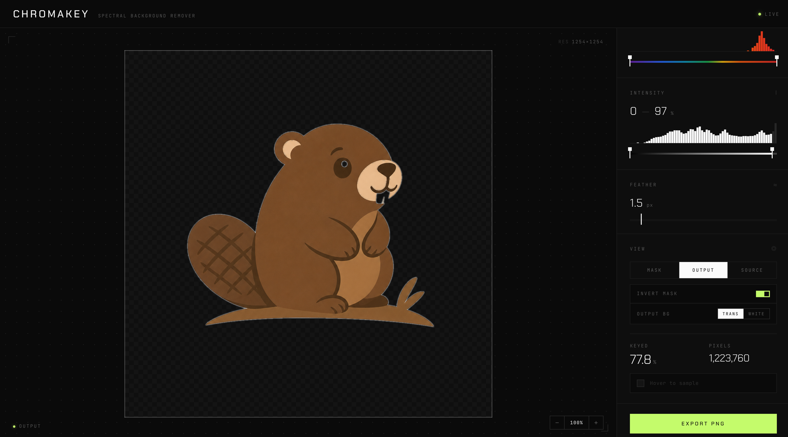

# CHROMAKEY

**[Try it now → chromakey-phi.vercel.app](https://chromakey-phi.vercel.app/)**



**A spectral background remover for AI-generated images, logos, and graphics.**

## The problem

You generated a logo or graphic with an AI tool (Midjourney, DALL·E, ChatGPT, Stable Diffusion, etc.) and it looks great — except it's stuck on a white or coloured background. To drop it into a slide, a website, or another design, you need a clean transparent PNG.

The usual options are painful: open Photoshop, fight with the magic wand, or upload your work to some sketchy cloud service that may keep a copy. Existing one-click "remove.bg" tools either cost money, gate exports behind an account, or mangle the edges of clean vector-style art.

## The solution

CHROMAKEY is a fast, free, in-browser tool purpose-built for this exact job: take an AI-generated image with a flat background and give you back a transparent PNG in seconds. No install, no account, no cloud upload — everything runs locally in your browser.

---

## What it does

Drop in a PNG, JPG, or WebP. CHROMAKEY lets you select which parts of the image to remove based on two thresholds:

- **Wavelength (color)** — isolate pixels by their position on the visible light spectrum (380–700nm). Handles greens, blues, reds, any saturated color.
- **Intensity (brightness)** — isolate pixels by how light or dark they are. This is how you kill a white background: dial the minimum up until only the near-white pixels are selected.

You get a live preview with a red mask overlay showing exactly what will be removed. Tweak until happy, then export a transparent PNG.

## Features

- Dual-range sliders for wavelength and intensity
- Live histograms under each slider showing your image's actual color distribution — so you can see where the background peaks and bracket it precisely
- Feather slider for soft, anti-aliased edges
- Invert mask toggle (keep the subject instead of the background)
- Output mode supports transparent, solid white, or any user-picked silhouette color (great for masks and background removal)
- Zoom with wheel, buttons, or keyboard; click-drag to pan
- Pixel probe on hover — shows wavelength and intensity of any pixel you point at
- Live stats: percentage of image keyed, pixel count
- Exports full-resolution PNG (up to 1800px on the long edge)
- Export silhouette as PNG — collapse the kept region to a single flat color (white, black, or anything you pick) for use as a mask, stencil, or solid-color asset

## Running it

CHROMAKEY uses [Vite](https://vitejs.dev/) for local dev and production builds.

```bash
npm install
npm run dev
```

Then open `http://localhost:5173` in your browser.

To produce a static build for hosting:

```bash
npm run build      # outputs dist/
npm run preview    # serves dist/ for a local smoke-test
```

The built `dist/` folder is a plain set of static files — drop it on any static host. The repo also deploys cleanly to [Vercel](https://vercel.com)'s free tier: import the repo and Vercel will auto-detect the Vite preset (build = `vite build`, output = `dist`).

## How to use

1. **Drop an image** into the viewport (or click to browse)
2. **Pick your target color** with the wavelength slider — the histogram below it shows where your image's pixels actually cluster on the spectrum, so just bracket the peak that represents your background
3. **Refine with intensity** if needed
4. **Feather** a little if the edges look jagged (0.5–1.5px is usually enough)
5. **Toggle Invert** if you accidentally keyed out the subject
6. **Switch to Output view** to preview the final result; pick transparent or white background
7. **Export PNG** for the keyed image, or **Export Silhouette** for a flat-color mask (see below)

## Two ways to export

**Export PNG** — your original image with the keyed region removed. Use this for the normal "AI art on a transparent background" workflow.

**Export Silhouette** — every pixel that survived the key is repainted in a single flat color (the swatch next to **Silhouette color**), on a transparent background. Removed pixels stay transparent. The colour you pick *replaces* the source pixels entirely — none of the original RGB is preserved.

Why you'd use it:
- **Pure white or pure black mask** — pick `#ffffff` or `#000000` and you've got an alpha matte ready for Photoshop, After Effects, or an ML pipeline.
- **Solid-color asset** — pick any colour to turn your keyed subject into a flat silhouette (sticker, stencil, logo cutout).
- **Hard binary edge** — set the **Feather** slider to 0 before exporting; every kept pixel becomes fully opaque, every removed pixel becomes fully transparent. Leave feather > 0 for a soft anti-aliased edge.
- **Invert respected** — the **Invert mask** toggle is honoured, so you can flip which side becomes the silhouette.

The exported file is named `chromakey-silhouette-<hex>.png` (e.g. `chromakey-silhouette-ffffff.png`).

### Recipe: removing white backgrounds from AI art

Leave wavelength at full range (380–700nm), pull **intensity min** up to around 88–92%, add 0.5–1px feather. Done.

### Recipe: removing a green screen

Drag the wavelength handles to hug the green peak in the histogram (around 500–560nm). Leave intensity wide open.

### Recipe: isolating just the dark parts

Pull **intensity max** down so only low-brightness pixels are selected. Good for extracting line art or shadows.

### Recipe: exporting a binary mask for background removal

1. Set up your key as usual until the red overlay covers exactly what you want to remove.
2. Pull the **Feather** slider to 0 — this guarantees a hard binary edge.
3. Click the **Silhouette color** swatch and pick `#ffffff` for white-on-transparent or `#000000` for black-on-transparent.
4. Hit **Export Silhouette**.

The PNG you get is a flat silhouette of the kept region: every kept pixel is your chosen colour at full opacity, every removed pixel is fully transparent. Drop it into Photoshop as a layer mask, feed it to an ML pipeline, or use it as a stencil.

## Keyboard shortcuts

| Key | Action |
|---|---|
| `+` / `=` | Zoom in |
| `-` | Zoom out |
| `0` | Fit to screen |

## Browser support

Anything modern — Canvas 2D and ES6 are the only hard requirements:

- Chrome / Edge 90+
- Firefox 88+
- Safari 14+

## Privacy

Your images never leave your computer. All processing happens client-side in JavaScript. No uploads, no telemetry, no accounts.

## Tech notes

- Vanilla HTML / CSS / JavaScript — zero frameworks, zero dependencies
- Color thresholding uses HSV with a hue-to-wavelength approximation (red ≈ 700nm, violet ≈ 380nm). Non-spectral magentas/pinks are deliberately excluded so they don't get false-positive matched by any wavelength range.
- Feathering is a Gaussian blur on the mask's alpha channel, applied after invert so edges soften correctly regardless of direction
- Large images are downscaled to 1800px on the long edge for responsive slider performance

## License

MIT — see `LICENSE`.
